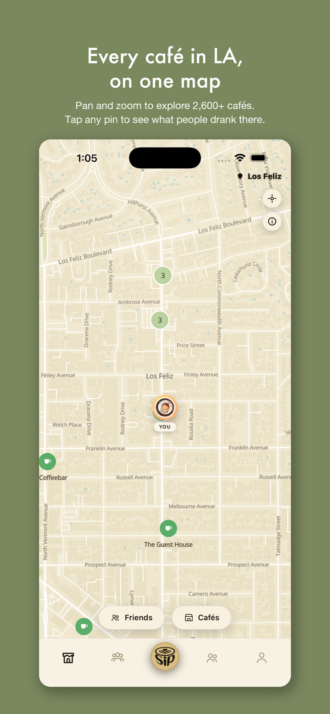
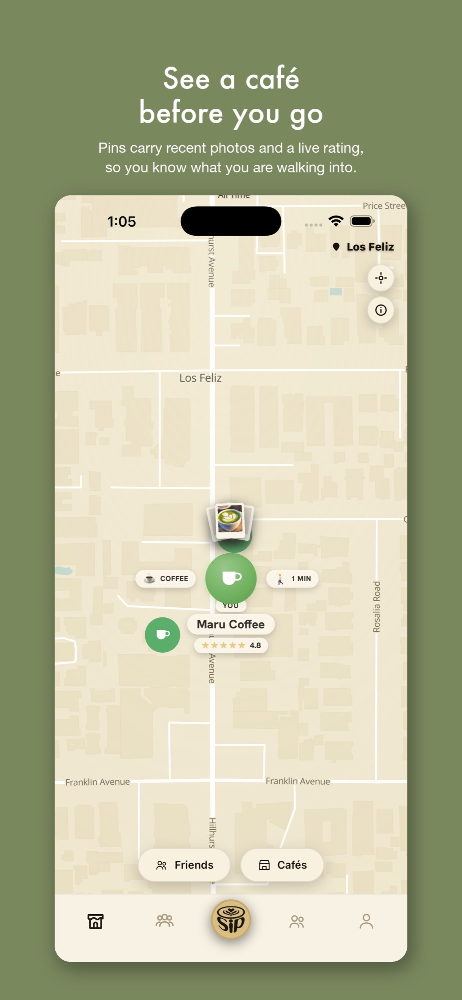
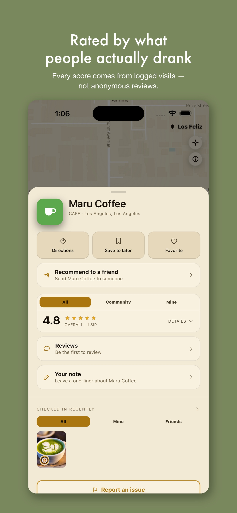
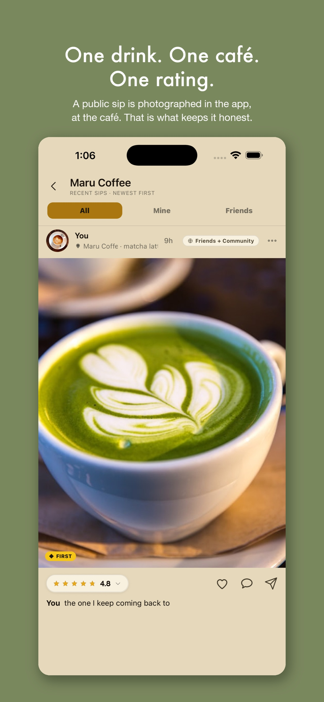
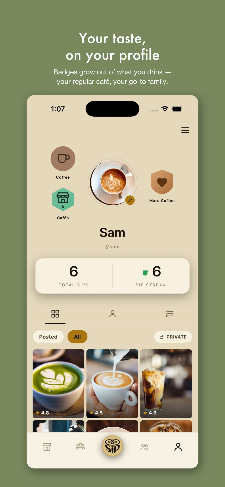

# Sip

**A social café-discovery app for Los Angeles, where the community rates cafés by what they
actually drank.**

Solo project, built from scratch starting in July 2026. React Native / Expo on iOS, Supabase
Postgres behind it, and a catalog of **2,600 real LA cafés** built from open geodata and checked
against their current listings. Operated by Ottoco LLC.

> **Status (25 September 2026): version 1.0 is in App Store review.** Build 24 was submitted on
> 24 September. See [Where it stands](#where-it-stands).

This repository is a write-up. **The application source is private**. It holds a live database's
schema and the row-level-security policies that are the app's actual security boundary. What's
here is the architecture, the engineering problems worth reading about, and the numbers.

The parts that *can* be public are:
**[open-place-toolkit](https://github.com/chrislach1546-ops/open-place-toolkit)**, nine modules
from this project's data pipeline, with 137 tests and no dependencies.

---

## Screenshots

<table>
  <tr>
    <td></td>
    <td></td>
    <td></td>
    <td></td>
    <td></td>
  </tr>
  <tr>
    <td align="center">Every café on one map</td>
    <td align="center">See a café before you go</td>
    <td align="center">Rated by real visits</td>
    <td align="center">One drink, one rating</td>
    <td align="center">Badges from what you drink</td>
  </tr>
</table>

These are the App Store screenshots submitted with build 24. The account shown is a demo
profile.

---

## The idea

Every café app answers "what's near me, and what's its average rating?" The rating is the weak
part. A 4.3 stitched together from anonymous text reviews tells you almost nothing. You don't know
what those people ordered, whether they even went, or what they'd have said about the flat white
you're about to buy.

The unit of content in Sip is a **sip**: one drink, at one café, with a photo and a rating. It isn't
a paragraph about the ambience. It's the actual thing someone drank. A café's score is built from the
community's real, logged visits, so it answers the questions that matter: *is the coffee good*, and
*what should I order*.

On top of that sits a social layer. You follow people, see where they've been and what they
ordered, recommend cafés to them, and keep lists of the places you mean to try. The community
tells you a café is worth going to, and the people whose taste you trust tell you what to get when you're there.

## What's in version 1.0

- **The map.** All 2,600 cafés on a custom-styled map with clustering. Pins carry recent photos
  and a live rating, and you can see which friends are at a café right now.
- **Logging a sip.** Photo or video from the in-app camera, a drink, a star rating and a line of
  text. Each sip is **private**, **friends**, or **friends + community**.
- **Posting integrity.** A public sip has to be taken at the café. The phone checks you're within
  75 m, and the database refuses a shared sip that arrives without that check. A content filter runs
  in the database too, not only in the app.
- **Café pages.** Ratings split into All, Community and Mine, plus reviews, a private note, save,
  favourite, directions, "recommend to a friend", and recent check-ins.
- **Social.** Friends, a Friends feed and a Community feed, comments, likes, direct messages, and
  café lists.
- **Profiles.** Badges earned from what you actually drink (your regular café, your usual drink
  family), sip streaks, and a gold mark for the first people to log a café.
- **Safety and control.** Report and block, in-app account deletion, and a full export of your
  own data.
- **Sign in with Apple only.** There are no passwords to leak.

---

## What it's made of

| Layer | Choice | Why |
|---|---|---|
| App | React Native 0.86 + Expo SDK 57, TypeScript | One codebase, real native camera and gestures |
| Navigation | Expo Router | File-based routes |
| Map | MapLibre with a custom style and clustering | 2,600 pins need clustering, not a list |
| Backend | Supabase: Postgres, Auth, Storage, Realtime, Edge Functions | Managed Postgres, so the security model lives *in the database* |
| Auth | Supabase Auth, Sign in with Apple as the only provider | Don't roll your own auth. Email/password is switched off in production |
| Errors | Sentry, with personal data scrubbed before sending | `sendDefaultPii: false`, plus a `beforeSend` that walks the whole event and its breadcrumbs removing emails, IPs and tokens |
| Data | OpenStreetMap + Overture Maps, hand-verified | Openly licensed sources. See [the catalog write-up](docs/catalog.md) |
| CI | GitHub Actions on every push | TypeScript, the full test suite, a secret scan of the whole git history, and the database security suite |

### By the numbers

Measured 25 September 2026 on `main`. The test counts come from the CI run on the latest commit.

| | |
|---|---|
| App source | 215 files, ~41,500 lines of TypeScript (tests not counted) |
| Commits | 2,439 in under three months |
| Database migrations | 172 |
| Cafés in the catalog | 2,600 open in production |
| App unit and component tests | 256 suites, **2,963 tests**, all passing |
| Database security tests | 86 pgTAP files, **2,241 assertions**, all passing |
| Data-pipeline test files | 204 |
| Public tables | 35 |
| Tables with row-level security on | **35, all of them** |
| RLS policies | 65 |
| Edge Functions | 2 (account deletion, push delivery) |

---

## The three problems worth reading about

### 1. [Deciding whether two records are the same café](docs/place-matching.md)

Merging two open-geodata sources means answering "is this the same place I already have?" a few
million times. Get it wrong one way and the map fills with duplicate pins. Get it wrong the other
way and you silently delete real cafés.

Covers how `'steak_house'` came to match `'tea'` and put steakhouses on a café map, how a
distance-only rule quietly discarded 224 real cafés, and how a coffee shop that closed years ago
kept haunting its own address.

### 2. [Testing the security boundary, not the login screen](docs/security-model.md)

The app uses a public API key. That's how the architecture is meant to work, and it means
**row-level security is the only thing standing between one user's data and another's**. So the
policies get tested like application code: 86 pgTAP files and 2,241 assertions, running against a
real Postgres instance, asserting that user A *cannot* read user B's private rows.

Covers why the anon key being public is fine, what deny-by-default looks like in practice, and the
bugs this caught.

### 3. [Building a catalog you can trust](docs/catalog.md)

A café catalog is not a one-time import. Sources disagree, businesses close, names get corrected,
and a tenant turns over without anyone updating the map.

Covers the rule that no import may ever re-key or delete an existing row, how removals stay
reversible, why every deletion ships as a migration listing each affected id, and how the catalog
was checked for cafés that had closed.

---

## Things I'd want a reader to notice

**The security model is enforced in the database.** It isn't in the UI or a middleware layer. Every
table denies by default and grants back narrowly, and the policies have their own test suite. Rules
the app shows the user, such as "you must be at the café to post publicly", are enforced again in
Postgres so that a modified client can't just skip them.

**Privacy was tested adversarially.** Before submission, the app went through two
privacy-and-security passes. Each one tested every feature from two accounts, plus a blocked
account and a deleted one. They closed real gaps: deleting an account now removes tags and
reactions, blocking now reaches comments and photos, and videos from the camera roll have their
location stripped before upload.

**No borrowed ratings.** Every score in Sip comes from a sip someone logged in the app. No star
average is imported from another platform, because the whole premise is real opinions from real
visits.

**Data changes are reviewable.** Every café removal is a migration that lists every affected id and
the evidence for it. Nothing is deleted by a category sweep that a human never read.

**Old app versions keep working.** Database changes follow expand → migrate → contract. A
migration may add but never remove anything a shipped build still reads, because build N stays on
phones for weeks after build N+1 ships.

---

## Where it stands

| Date (2026) | Milestone |
|---|---|
| 6 July | First commit |
| July | Social layer, in-app camera, live café presence, push notifications |
| 2 August | Catalog rebuilt from Overture + OpenStreetMap, to about 3,000 cafés |
| 21 August | Liveness pass: 2,133 cafés verified open against their current listings, 18 retired, 11 renamed |
| 7 September | Posting integrity: the at-the-café check, the content filter, and the legal text |
| 22 September | Build 23 rejected by App Review under Guideline 5.1.1(iv), for a "Not now" button on a permission prompt. Fixed the same day |
| 22–24 September | Two privacy-and-security hardening passes, 17 database migrations, all live |
| 24 September | Hand check of 33 cafés an automated pass couldn't settle: 13 retired, 20 confirmed. **Build 24 submitted for review** |

**Now:** waiting on App Review for version 1.0.
**Next:** launch in Los Angeles once Apple approves it.

## Attribution

Café data derived from [OpenStreetMap](https://www.openstreetmap.org/copyright) (ODbL) and
[Overture Maps](https://overturemaps.org/). OSM-derived Overture records remain ODbL.

[Privacy Policy](https://chrislach1546-ops.github.io/sip-app/legal/#privacy) ·
[Terms of Service](https://chrislach1546-ops.github.io/sip-app/legal/#terms) ·
[Support](https://chrislach1546-ops.github.io/sip-app/support/)
